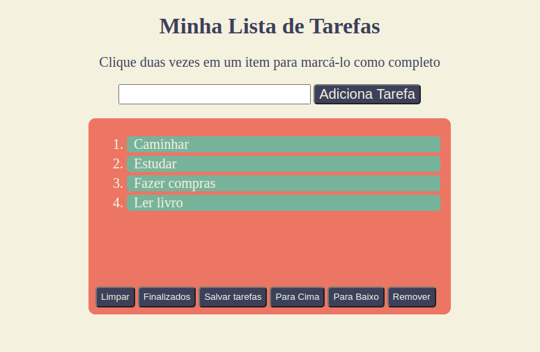

  

###

<h2 align="center">Bem vindo(a) ao projeto "Lista de Tarefas"</h2>

###

Nesse projeto foi desenvolvido um pequeno CRUD em HTML, CSS E JavaScript de  lista de tarefas .

###

<h4 align="left">Neste projeto você será capaz de:</h4>

###

* Adicionar uma nova tarefa
* Editar tarefa
* Marcar tarefa já feitas
* Excluir uma tarefa
* Excluir tarefas marcadas

###

<h3 align="center">Linguagens utilizadas</h3>

###

  
  
  

###

<h4 align="center">Modelo do projeto</h4>

###

  <a href = 'https://listadetarefas-crud.netlify.app/' target="_blank"> Lista de Tarefas <a>

###

  

###

  

###